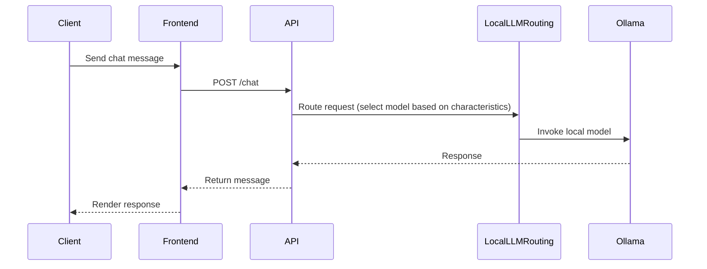

# Request Routing Sequence

This diagram shows the simplified request routing sequence from the user to the local LLM and back.

Notes:

- This shows the current simplified architecture with local LLM routing only.
- No cloud providers, RAG, or complex verification are currently implemented.
- The routing service selects between local models (mistral, qwen2.5, phi3, gemma) based on request characteristics.

